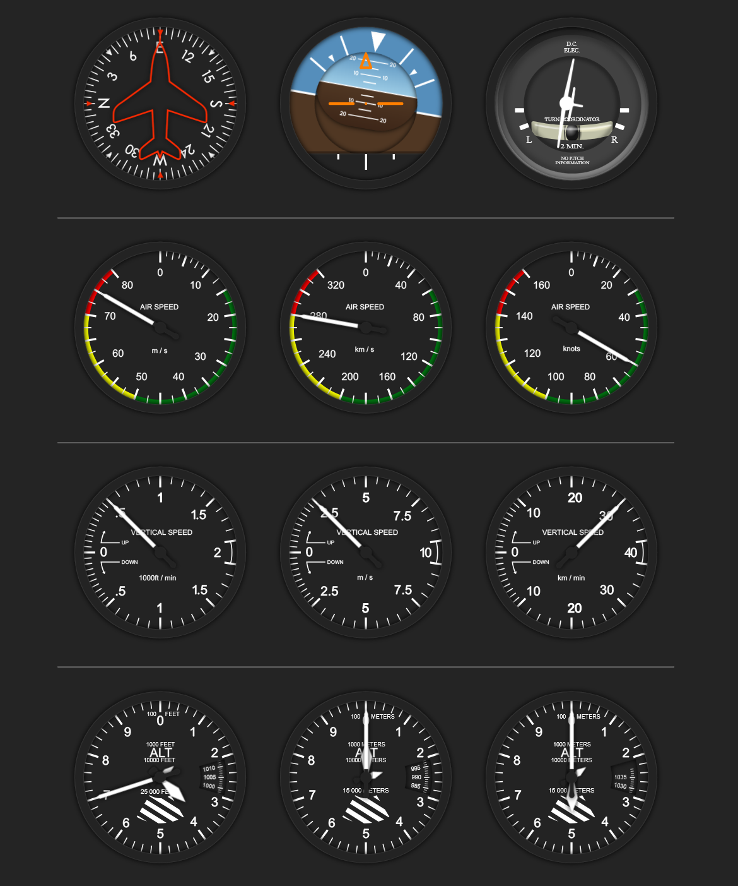

# react-typescript-flight-indicators-extended

**This is a fork of https://github.com/starnutoditopo/react-typescript-flight-indicators.**

A fork of https://github.com/starnutoditopo/react-typescript-flight-indicators with metric instruments, features and better support.

[](https://www.npmjs.com/package/react-typescript-flight-indicators-extended) [](https://standardjs.com)

> The `react-typescript-flight-indicators-extended` package allows you to display high quality flight indicators using html, css3, React, TypeScript and SVG images.
The methods make customization and real-time implementation really easy.
Further, since all the images are vector svg, you can resize the indicators to your application without any quality loss! - _Original forked repo_

> `react-typescript-flight-indicators` is a ported from [skyhop/react-flight-indicators](https://github.com/skyhop/react-flight-indicators), and refactored for use with React and TypeScript.

Currently supported indicators are :
- Attitude (artificial horizon)
    - Pitch in degrees
    - Roll in degrees
- Heading
    - Heading in degrees
- Turn Coordinator
    - Roll in degrees
- Air speed
    - Meters per second
    - Kilometers per second
    - Knots
- Altimeter
    - Feet
    - Meters
    - Pressure in hPa (Hectopascal)
    - Added 10,000k needle for altimeter
- Variometer (Vertical speed)
    - Feet per minute
    - Meters per second
    - Kilometers per minute

Other changes within this fork:
- Smaller package size
- ESM and CJS module support
- Supports React 18 onwards

## Install

Using YARN:

```bash
yarn add react-typescript-flight-indicators-extended
```

Alternatively, with NPM:

```bash
npm install --save react-typescript-flight-indicators-extended
```

## Usage

```ts
import { Airspeed, AirspeedUnits, Altimeter, AltimeterUnits, AttitudeIndicator, HeadingIndicator, TurnCoordinator, Variometer, VariometerUnits } from 'react-typescript-flight-indicators-extended'


function App() {
  return (
	  	<>
            <HeadingIndicator heading={90} showBox={false} />
            <AttitudeIndicator roll={10} pitch={-10} showBox={false} />
            <TurnCoordinator turn={100} showBox={false} />

            <hr />

            <Airspeed speed={75} showBox={false} unit={AirspeedUnits.METERS_PER_SECOND} />
            <Airspeed speed={280} showBox={false} unit={AirspeedUnits.KILOMETERS_PER_SECOND} />
            <Airspeed speed={60} showBox={false} unit={AirspeedUnits.KNOTS} />

            <hr />

            <Variometer vario={500} showBox={false} unit={VariometerUnits.FEET_PER_MINUTE} />
            <Variometer vario={2.5} showBox={false} unit={VariometerUnits.METERS_PER_SECOND} />
            <Variometer vario={30} showBox={false} unit={VariometerUnits.KILOMETERS_PER_MINUTE} />

            <hr />

            <Altimeter altitude={13700} pressure={1005} unit={AltimeterUnits.FEET_PER_MINUTE} showBox={false} />
            <Altimeter altitude={20000} pressure={990} showBox={false} unit={AltimeterUnits.METERS_PER_SECOND} />
            <Altimeter altitude={15000} pressure={1035} showBox={false} unit={AltimeterUnits.METERS_PER_SECOND} />
	  	</>
  )
}

export default App
```

# Instruments



## License

GPL-3.0 © [Starnuto di topo](https://github.com/starnutoditopo)

## Authors and License

Forked from starnutoditopo's https://github.com/starnutoditopo/react-typescript-flight-indicators.

Originally this project has been based on work by igneosaur, which could be found [on Bitbucket](https://bitbucket.org/igneosaur/attitude-indicator).

Further work is done by Sébastien Matton (seb_matton@hotmail.com), who developed the jQuery plugin as part of his master's for showing realtime flight information from a quadcopter.

[Corstian Boerman](https://corstianboerman.com) has adapted the project by Sébastien for use with React.

The project is published under GPLv3 License. See LICENSE file for more informations
