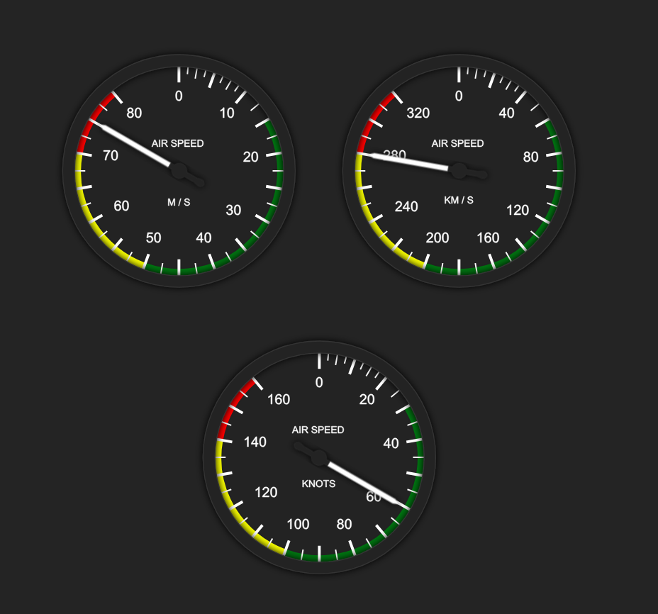

# react-typescript-flight-indicators-extended

**This is a fork of https://github.com/starnutoditopo/react-typescript-flight-indicators.**

> A React + Typescript porting of react-flight-indicators (https://github.com/skyhop/react-flight-indicators) extended with metric indicators and latest React version (19)

[](https://www.npmjs.com/package/react-typescript-flight-indicators) [](https://standardjs.com)

The `react-typescript-flight-indicators` package allows you to display high quality flight indicators using html, css3, React, TypeScript and SVG images.
The methods make customization and real-time implementation really easy.
Further, since all the images are vector svg, you can resize the indicators to your application without any quality loss!

Currently supported indicators are :

- Attitude (artificial horizon)
- Heading
- Vertical speed
- Air speed
- Altimeter
- Variometer

`react-typescript-flight-indicators` is a porting from [skyhop/react-flight-indicators](https://github.com/skyhop/react-flight-indicators), and refactored for use with React and TypeScript.

## Install

Using YARN:

```bash
yarn add react-typescript-flight-indicators-extended
```

Alternatively, with NPM:

```bash
npm install --save react-typescript-flight-indicators-extended
```

## Usage

```tsx
import React, { Component } from "react";

import {
    Airspeed,
    Altimeter,
    AttitudeIndicator,
    HeadingIndicator,
    TurnCoordinator,
    Variometer,
    SpeedUnits,
} from "react-typescript-flight-indicators";

const Example = () => {
    return (
        <>
            <HeadingIndicator heading={Math.random() * 360} showBox={false} />
            <hr />
            <Airspeed speed={Math.random() * 160} showBox={false} unit={SpeedUnits.METERS_PER_SECOND} />
            <hr />
            <Altimeter altitude={Math.random() * 28000} showBox={false} />
            <hr />
            <AttitudeIndicator
                roll={(Math.random() - 0.5) * 120}
                pitch={(Math.random() - 0.5) * 40}
                showBox={false}
            />
            <hr />
            <TurnCoordinator
                turn={(Math.random() - 0.5) * 120}
                showBox={false}
            />
            <hr />
            <Variometer vario={(Math.random() - 0.5) * 4000} showBox={false} />
        </>
    );
};
```

# Instruments

## Airspeed

- Meters per second
- Kilometers per second
- Knots



## License

GPL-3.0 © [Starnuto di topo](https://github.com/starnutoditopo)

## Authors and License

Originally this project has been based on work by igneosaur, which could be found [on Bitbucket](https://bitbucket.org/igneosaur/attitude-indicator).

Further work is done by Sébastien Matton (seb_matton@hotmail.com), who developed the jQuery plugin as part of his master's for showing realtime flight information from a quadcopter.

[Corstian Boerman](https://corstianboerman.com) has adapted the project by Sébastien for use with React.

The project is published under GPLv3 License. See LICENSE file for more informations
